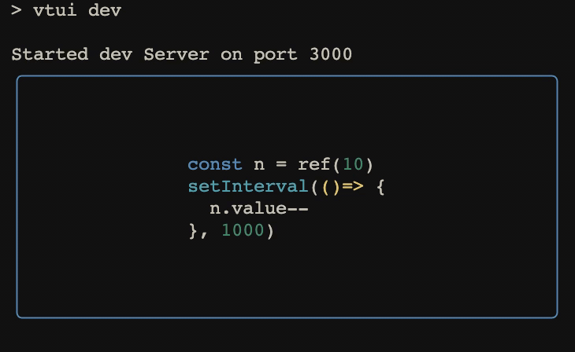

# syntax-highlight

Syntax highlight component for [vue-termui](https://github.com/vue-terminal/vue-termui).

<div align="center">
	<br>
	<br>
	
	<br>
	<br>
	<br>
</div>

## Install

```shell
npm install @vue-termui/syntax-highlight
```

## Usage

```html
<script lang="ts" setup>
  improt { TuiBox } from 'vue-termui'
  import SyntaxHighlight from '@vue-termui/syntax-highlight'

  const code = `const hello = 'world'`
</script>

<template>
  <TuiBox>
    <SyntaxHighlight :code="code" />
  </TuiBox>
</template>
```

## Props

### code

- Type: `string`

Source code to highlight.

### lang

- Type: `string`

Language of the source code. If you don't set it yourself, this component will try to auto-detect it. [All languages of highlight.js](https://github.com/highlightjs/highlight.js/blob/master/SUPPORTED_LANGUAGES.md#supported-languages) are supported.

### theme

- Type: [Theme](https://github.com/felixfbecker/cli-highlight/blob/main/src/theme.ts#L280)<br>

You can write your custom theme and pass it as a prop. [More info regarding custom theme](https://github.com/felixfbecker/cli-highlight/blob/main/README.md#themes).
